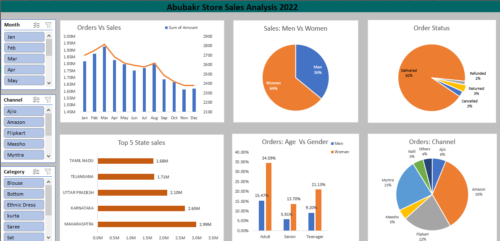

## Customer Sales Analysis - Excel Project

This repository contains an Excel project focused on analyzing customer sales data. The dataset includes the following key details:

- **Customer Location:** Geographical information of the customers.
- **Gender:** Gender demographics of the customers.
- **Product Category:** Classification of the products sold.
- **Profit:** Profit margins from the sales.
- **Cost:** Costs associated with the products.
- **Revenue:** Total revenue generated from the sales.

### Objective

The main objective of this project is to provide insights into customer behavior and sales performance through various metrics such as profit, cost, and revenue, categorized by location, gender, and product type.

### Features

- **Data Analysis:** In-depth analysis of sales data to identify trends and patterns.
- **Visualizations:** Graphical representations of key metrics for easy interpretation.
- **Summary Statistics:** Comprehensive summary of the data, highlighting important figures.

### How to Use

1. Download the Excel file from the repository.
2. Open the file in Microsoft Excel or any compatible software.
3. Explore the different sheets and analyses provided.

Feel free to explore, provide feedback, or contribute to this project.

