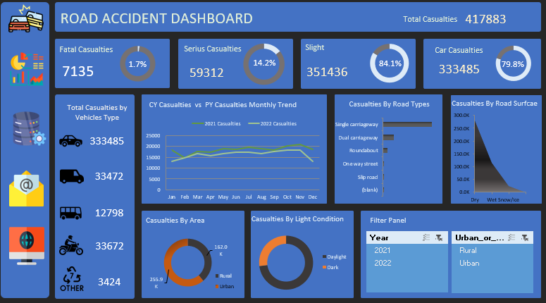

# Road Accident Dashboard

## Overview

This project provides a comprehensive dashboard for analyzing road accidents. The data used in this project includes various details about road accidents such as the severity of casualties, types of vehicles involved, and road conditions. The dashboard is designed to help users easily understand and visualize accident trends and patterns.

## Data Details

The Excel sheet contains the following columns:
- **Severity of Casualties:** 
  - Serious
  - Fatal
  - Slight
- **Vehicle Types:** Details of the types of vehicles involved in accidents.
- **Surface Condition:** Information about the condition of the road surface at the time of the accident.
- **Light Condition:** Light condition such  as dark or daylight etc.

## Features

- **Interactive Dashboard:** Allows users to filter and view data based on different parameters.
- **Visualizations:** Includes charts and graphs to provide a visual representation of the data.
- **Insights:** Offers key insights into the factors contributing to road accidents.

## Usage

1. **Download the Excel file:** [Download link]
2. **Open the Excel file:** Use Microsoft Excel or any compatible software to open the file.
3. **Explore the Dashboard:** Navigate through different sheets and visualizations to analyze the data.

## How to Contribute

If you would like to contribute to this project, please follow these steps:
1. Fork the repository.
2. Create a new branch (`git checkout -b feature-branch`).
3. Make your changes.
4. Commit your changes (`git commit -m 'Add some feature'`).
5. Push to the branch (`git push origin feature-branch`).
6. Open a Pull Request.

 
